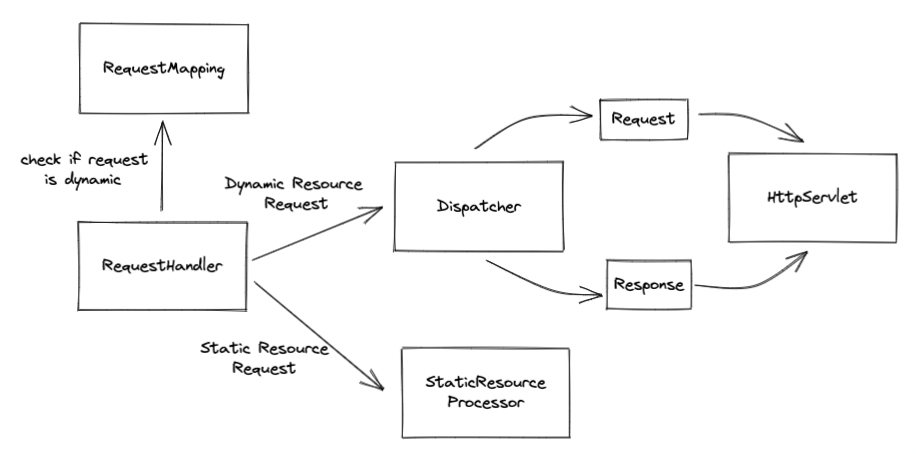

# java-was
Java Web Server Project for CodeSquad Members 2022

## 1단계 HTTP GET 응답

### To-do List

- [x] run에 구현된 메서드를 순차적으로 파악하기 위해 extract 후 private 메서드로 작성하였다. 
- [x] 요청의 ``url``을 ``parsing``하여, 해당 경로에 해당하는 파일을 ``byte``로 변환해주는 과정을 ``IOUtils``로 이동하였다.

### 정리

### Jay

#### 알게된 키워드

- `안전한 HTTP 메소드` : GET, HEAD 와 같이 **서버의 상태를 변경시키지 않는** 메소드
- `HTTP 멱등성` : 동일한 요청을 여러번 실행해도, 서버는 항상 **동일한 상태를 보장**해야함
  - ex) 회원 이름을 `jay` 로 변경하는  **수정 요청(PUT)** 은 몇번을 실행해도, 서버에 있는 회원의 이름은 항상 `jay` 여야 한다.

#### 알게된 것

- 로깅 설정(ex Logback.xml)을 통해, 특정 패키지의 로그 레벨만 변경할 수 있는 것
- 한 서버의 최대 허용량은 `포트` 와 관련있음.
  -  HTTP 통신도 결국 TCP/IP 레벨에서는 특정 `포트` 로 소켓통신을 함.
     그런데 컴퓨터 한대는 최대 **65536개** 의 포트만 사용할 수 있기 때문에,
     서버의 성능이 아무리 좋아도 5~6만개의 요청만 동시에 처리가 가능하다.

---

### Lucid

#### 알게된 키워드
- ``LOG level`` : 설정파일(XML, properties 등)을 통해 run 환경에 맞는 로깅 레벨을 설정 가능
- ``telnet`` : 이넡넷 또는 로컬 영역 네트워크 연결에 쓰이는 네트워크 프로토콜이다. 서버에 요청을 할 수 있으나 모든 내용을 평문으로 작성해줘야 해서 불편하고, 명령어에 대한 정보가 노출된다.
- ``MIME-type(Multi-purpose Internet Mail Extension)`` : 파일 변환을 의미하며, 기존에 이메일과 함께 동봉된 파일을 텍스트 문자로 전환해서 이메일 시스템을 통해 전달하기 위해 개발되었기 때문에 이름이 ``Internet Mail Extension``가 붙어있다.

#### 알게된 것
- ``System.getProperty("user.dir")``를 통해 JVM이 시작된 경로를 알 수 있다. 이를 통해 절대 경로를 생성할 수 있다.
- ``Socket``을 통해 편리하게 ``InputStream, OutputStream``을 읽어올 수 있음을 알게 되었다.
- 쓰레드를 통해 ``request``요청을 여러 개 받아 처리할 수 있다는 것을 알았다.   

---

## 2단계 GET으로 회원가입 기능 구현

### To-do List

- [x] Application URL 매핑 정보 담는 클래스 생성 (``RequestMapping.class``)
- [x] ``RequestMapping.class``를 확인해서 `정적` or `동적` 요청인지 체크
- [x] ``StaticResourceProcessor``를 통한 정적 처리
- [x] 어플리케이션 계층을 통한 동적 처리
  - [x] 매핑 정보로 특정 클래스 메소드를 실행 해주는 클래스(``Dispatcher``)
  - [x] ``Request, Response`` 객체를 통한 요청, 응답 전달
  - [x] ``HttpServlet``을 통한 메인 로직 실행

### 전체 구성

#### 1. RequestHandler
- 클라이언트 Request를 parsing한 후, 정보를 담고 있는 ``RequestLine`` 객체 생성 
- 동적 요청일 경우, ``Dispatcher``로 처리 위임
- 정적 요청일 경우, ``StaticResourceProcessor``로 처리 위임
- 최종 처리 결과를 클라이언트로 응답

 

#### 2. Dispatcher
- 동적 리소스 요청 처리 기능
- ``RequestLine`` 기반으로 ``Request`` 객체 생성
- 매핑 정보의 URL을 기반으로 처리할 수 있는 ``HttpServlet``을 생성하여 처리를 위임
- `HttpSetvlet`처리 결과인 ``Response``를 ``RequestHandler``로 반환
- 싱글톤으로 설계

 

#### 3. StaticResourceProcessor
- 정적 리소스 요청 처리 기능
- requestUrl 기반으로 내부 정적 리소스를 byte 배열로 반환처리
- 싱글톤으로 설계

 

#### 4. RequestMapping
- url 과 Servlet 매핑정보를 저장하는 static 클래스

 

#### 5. HttpServlet

- 사용자 요청을 처리하는 Servlet 을 추상화한 클래스
- `Request` 의 `HttpMethod` 에 따라 실행되는 로직이 구현되어있음
- 실제로 사용자 요청을 처리해야할 경우, 이 클래스를 상속하여 HTTP Method 에 해당되는 메소드를 오버라이드 하여 구현해야함

 

#### 6. Request

- 사용자의 요청을 추상화한 클래스
- HTTP Method 정보, 쿼리파라미터 정보 등을 담고있음

 

#### 7. Response

- 서버의 응답을 추상화한 클래스
- HTTP Status 정보를 담고있음
    - 현재 단계에서는 status 만 필요하여, status 만 저장함

 

### 정리

---

### Jay

#### 알게된 것

- `split()` 내부적으로 정규식을 이용하기 때문에 `.` 이나 `?` 같은 정규식 예약어는 `\\`를 붙여줘야 함
- HTTP Socket 통신은 처음 연결시에만 3-way handshake 를 한다는 것
- 이론으로만 봤던 리플렉션을 직접 활용해본것이 처음이라 신기하기도 했고, 의존성을 최소화한 구조를 만드는 노력을 한 것이 재밌었습니다.

---

### Lucid

#### 알게된 것
- 이론으로만 듣고 사용하고 있었던 웹 서버였는데, 직접 구현해보는 과정에서 정적 리소스와 동적 리소스의 처리 부분을 분리하여 동작시켜야 할 필요성을 느끼게 되었다.
- 리플렉션을 통해 런타임에 필요한 객체를 동적으로 생성할 수 있는 방법을 알게 되었다. 이를 통해 기존에 인터페이스 구현체로 관리되는 방법 처럼 미리 객체를 생성해두기보다는, 필요 시점에 특정 클래스를 만들어 사용할 수 있는 장점이 있다.
