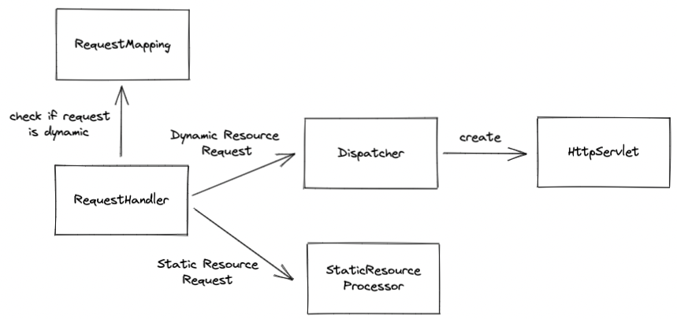

# java-was
Java Web Server Project for CodeSquad Members 2022

## 1단계 HTTP GET 응답

### To-do List

- [x] run에 구현된 메서드를 순차적으로 파악하기 위해 extract 후 private 메서드로 작성하였다. 
- [x] 요청의 ``url``을 ``parsing``하여, 해당 경로에 해당하는 파일을 ``byte``로 변환해주는 과정을 ``IOUtils``로 이동하였다.

### 정리

### Jay

#### 알게된 키워드

- `안전한 HTTP 메소드` : GET, HEAD 와 같이 **서버의 상태를 변경시키지 않는** 메소드
- `HTTP 멱등성` : 동일한 요청을 여러번 실행해도, 서버는 항상 **동일한 상태를 보장**해야함
  - ex) 회원 이름을 `jay` 로 변경하는  **수정 요청(PUT)** 은 몇번을 실행해도, 서버에 있는 회원의 이름은 항상 `jay` 여야 한다.

#### 알게된 것

- 로깅 설정(ex Logback.xml)을 통해, 특정 패키지의 로그 레벨만 변경할 수 있는 것
- 한 서버의 최대 허용량은 `포트` 와 관련있음.
  -  HTTP 통신도 결국 TCP/IP 레벨에서는 특정 `포트` 로 소켓통신을 함.
     그런데 컴퓨터 한대는 최대 **65536개** 의 포트만 사용할 수 있기 때문에,
     서버의 성능이 아무리 좋아도 5~6만개의 요청만 동시에 처리가 가능하다.

---

### Lucid

#### 알게된 키워드
- ``LOG level`` : 설정파일(XML, properties 등)을 통해 run 환경에 맞는 로깅 레벨을 설정 가능
- ``telnet`` : 이넡넷 또는 로컬 영역 네트워크 연결에 쓰이는 네트워크 프로토콜이다. 서버에 요청을 할 수 있으나 모든 내용을 평문으로 작성해줘야 해서 불편하고, 명령어에 대한 정보가 노출된다.
- ``MIME-type(Multi-purpose Internet Mail Extension)`` : 파일 변환을 의미하며, 기존에 이메일과 함께 동봉된 파일을 텍스트 문자로 전환해서 이메일 시스템을 통해 전달하기 위해 개발되었기 때문에 이름이 ``Internet Mail Extension``가 붙어있다.

#### 알게된 것
- ``System.getProperty("user.dir")``를 통해 JVM이 시작된 경로를 알 수 있다. 이를 통해 절대 경로를 생성할 수 있다.
- ``Socket``을 통해 편리하게 ``InputStream, OutputStream``을 읽어올 수 있음을 알게 되었다.
- 쓰레드를 통해 ``request``요청을 여러 개 받아 처리할 수 있다는 것을 알았다.   

---

## 2단계 GET으로 회원가입 기능 구현

### To-do List

- [x] Application URL 매핑 정보 담는 클래스 생성 (``RequestMapping.class``)
- [x] ``RequestMapping.class``를 확인해서 `정적` or `동적` 요청인지 체크
- [x] ``StaticResourceProcessor``를 통한 정적 처리
- [x] 어플리케이션 계층을 통한 동적 처리
  - [x] 매핑 정보로 특정 클래스 메소드를 실행 해주는 클래스(``Dispatcher``)
  - [x] ``Request, Response`` 객체를 통한 요청, 응답 전달
  - [x] ``HttpServlet``을 통한 메인 로직 실행

### 전체 구성

#### 1. RequestHandler
- 클라이언트 Request를 parsing한 후, 정보를 담고 있는 ``RequestLine`` 객체 생성 
- 동적 요청일 경우, ``Dispatcher``로 처리 위임
- 정적 요청일 경우, ``StaticResourceProcessor``로 처리 위임
- 최종 처리 결과를 클라이언트로 응답

 

#### 2. Dispatcher
- 동적 리소스 요청 처리 기능
- ``RequestLine`` 기반으로 ``Request`` 객체 생성
- 매핑 정보의 URL을 기반으로 처리할 수 있는 ``HttpServlet``을 생성하여 처리를 위임
- `HttpSetvlet`처리 결과인 ``Response``를 ``RequestHandler``로 반환
- 싱글톤으로 설계

 

#### 3. StaticResourceProcessor
- 정적 리소스 요청 처리 기능
- requestUrl 기반으로 내부 정적 리소스를 byte 배열로 반환처리
- 싱글톤으로 설계

 

#### 4. RequestMapping
- url 과 Servlet 매핑정보를 저장하는 static 클래스

 

#### 5. HttpServlet

- 사용자 요청을 처리하는 Servlet 을 추상화한 클래스
- `Request` 의 `HttpMethod` 에 따라 실행되는 로직이 구현되어있음
- 실제로 사용자 요청을 처리해야할 경우, 이 클래스를 상속하여 HTTP Method 에 해당되는 메소드를 오버라이드 하여 구현해야함

 

#### 6. Request

- 사용자의 요청을 추상화한 클래스
- HTTP Method 정보, 쿼리파라미터 정보 등을 담고있음

 

#### 7. Response

- 서버의 응답을 추상화한 클래스
- HTTP Status 정보를 담고있음
    - 현재 단계에서는 status 만 필요하여, status 만 저장함

 

### 정리

---

### Jay

#### 알게된 것

- `split()` 내부적으로 정규식을 이용하기 때문에 `.` 이나 `?` 같은 정규식 예약어는 `\\`를 붙여줘야 함
- HTTP Socket 통신은 처음 연결시에만 3-way handshake 를 한다는 것
- 이론으로만 봤던 리플렉션을 직접 활용해본것이 처음이라 신기하기도 했고, 의존성을 최소화한 구조를 만드는 노력을 한 것이 재밌었습니다.

---

### Lucid

#### 알게된 것
- 이론으로만 듣고 사용하고 있었던 웹 서버였는데, 직접 구현해보는 과정에서 정적 리소스와 동적 리소스의 처리 부분을 분리하여 동작시켜야 할 필요성을 느끼게 되었다.
- 리플렉션을 통해 런타임에 필요한 객체를 동적으로 생성할 수 있는 방법을 알게 되었다. 이를 통해 기존에 인터페이스 구현체로 관리되는 방법 처럼 미리 객체를 생성해두기보다는, 필요 시점에 특정 클래스를 만들어 사용할 수 있는 장점이 있다.

 

---

## 3단계 - POST로 회원 가입

### To-do List

- [X] POST 로 변경
  - HTTP POST Body parsing
- [X] form.html 변경
- [X] Redirection 기능 추가
  - 동적 요청 후, viewResolver 같은 기능 추가
- [X] 중복 아이디로 가입 시도할 경우, 가입되지 않고 가입 페이지로 이동
  - form.html 리다이렉션 추가
- [X] requestline parsing 하고나서 post 확인할때 String 에서 확인하지 말고, RequestLine 객체에서 확인하기

---

### Jay

#### 알게된 것

- Redirection HTTP Status
  - `301 Moved Permanently` : 요청된 URL이 (Location: header로 지정된) URL로 완전히 전환된 경우.
    
  - `302 Found` : HTTP/1.0과 초기 HTTP/1.1과 호환성 유지를 위해 남겨진 코드. 
    원래는 요청된 URL이 301과는 달리 임시로 변경된 것을 나타내는 것이었으나, 실제 구현이 HTTP 규약의 의도를 벗어나서 303과 307로 분리하여 제정
  - `303 See Other` : 요청된 URL이 잠시 다른 URL로 바뀐 것을 알림.
    (Location: header로 지정된) 바뀐 URL은 GET method로 접근해야 함

RFC 공식 문서에 따르면 서버에 구현하는 PRG 패턴의 응답으로 가장 의미가 적절한 응답코드는 303 입니다.
하지만 HTTP1.1 이전에는 303이 없어서 302를 해당 역할로 사용했었습니다.
그래서 지금도 호환성을 위해서 303 보다는 302를 사용한다고 합니다.

- 참고
  - https://datatracker.ietf.org/doc/html/rfc2616#section-10.3.3

---

### Lucid

#### 알게된 것

HTTP status code의 Redirection 의미에 대해서 알아보았다. 현재 필요한 ``Redirection``이 의미 상 ``302 : 일시적 자원의 이동``이라는 의미라기 보다는 특정 처리 요청 후 ``"서버가 반환해주는 경로로 재 요청을 진행해라"``라는 의미이기 때문에 이 시점에``302``를 사용하는게 맞을까라는 의문이 들었다.  
따라서 찾아보니 ``303: See Other(HTTP 1.1에서 추가)``가 좀 더 와닿게 되어 사용을 시도해 보았는데, 의미상 맞는 의미이긴 하지만 기존 ``HTTP 1.0``과의 호환성을 위해 `302`가 안전한 옵션이라고 한다. 

- 301 : 영구적 이동. browser에서 hard caching을 통해 이후 요청에 대해 캐시의 location 참고하여 보내게 된다.
- 302 : 일시적 이동. browser에 caching하지 않으며, 서버에서 리다이렉션을 삭제하게 되면 이전 버전에 엑세스가 가능하다.
- 303 : POST 요구를 GET 으로 redirect 하라는 것을 의미한다. 302와 마찬가지로 캐싱되지 않는다.
- 대부분의 클라이언트에서 302, 303은 동일한 역할을 수행한다.

 

---

## 4단계 쿠키를 이용한 로그인 구현

### To-do List

- [ ] 로그인 url 매핑을 위한 서블릿 구현 
- [ ] 로그인 성공 시 서블릿 내에서 쿠키 설정
- [ ] 로그인 실패 시 ``/user/login_failed.html``로 리다이렉션 처리

### 정리
